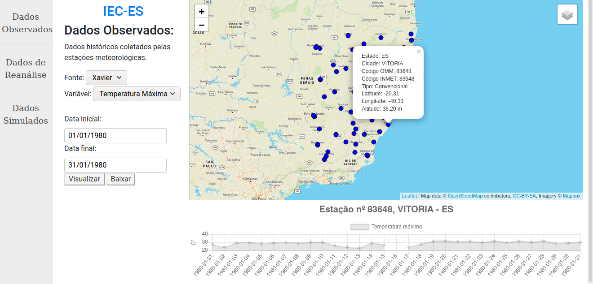

# Plataforma de dados do Instituto de Estudos Climáticos do Espírito Santo

A Plataforma de dados do Instituto de Estudos Climáticos do Espírito Santo visa disponiblizar ao público geral uma ferramenta para observação, consulta, estudo e compreensão dos efeitos das mudanças climáticas na região do estado do Espírito Santo.

Você pode acessar a plataforma clicando em [https://iec.ufes.br/](https://iec.ufes.br/).



## Instalação:

Esta plataforma está sendo desenvolvida usando **python 3.8**, e usando **pipenv 2018.11.26** para a virtualenv.

###O banco de dados:
- Primeiramente vamos instalar o postgresql e sua extensão para GIS:
  - Instale o postgis com `sudo apt-get install postgis`
  - Instale o postgreSQL
  - No terminal entre no psql:
    ```
    sudo -i -u postgres
    psql
    ```
  - Crie um banco de dados com nome "iec"
    `CREATE DATABASE iec;`
  - Conecte a este banco de dados:
    `\c iec`
  - Instale as extensões GIS:
    ```
    CREATE EXTENSION postgis;
    CREATE EXTENSION postgis_raster;
    ```
  - Até aqui tudo ok, podemos sair do postgres :D

###Django:
- Agora vamos instalar o django, um framework em python para o backend da plataforma;
- Você vai precisar gerar uma **SECRET_KEY** através [deste link](https://djecrety.ir/):
  - Crie um arquivo ".env" na pasta raíz e cole a SECRET_KEY da seguinte forma:
    `SECRET_KEY = "sua secret_key aqui"`
  - Esta secret_key é usada pelo django para criptografia, por isso não pode ser publicada no git.
- Ainda no arquivo **.env** cole:
  ```
  DEBUG = "True"
  ALLOWED_HOSTS = "127.0.0.1, .localhost,"
  ```
- Para configurar o banco de dados cole a seguinte linha no **.env** com as suas informações:
  `DATABASE_URL = "postgis://[usuario postgres]:[senha do psql]@localhost/iec"`
- Este arquivo **.env** é usado pelo pacote **python-decouple**, que separa informações sensíveis do código.
- Instale o *pipenv* para o gerenciamento da **virtualenv** e dos pacotes.
  - `pip install pipenv`
- Uma vez o pipenv instalado, instale a virtualenv e seus pacotes na pasta do repositório. O pipenv se encarrega de ler o arquivo **Pipfile** e instalar todos os pacotes. Se você estiver usando virtualenv pode usar esse arquivo como argumento do requirement:
  - `pipenv install`
- E então ative a virtualenv:
  - `pipenv shell`
  - Para aplicar as configurações necessárias no banco de dados configurado, rode o seguinte:
  - `python manage.py migrate`
- Rode o servidor django para verificar se está tudo certo:
  - `python manage.py runserver`
- Enfim, acesse o localhost :D
  - **http://127.0.0.1:8000/**
